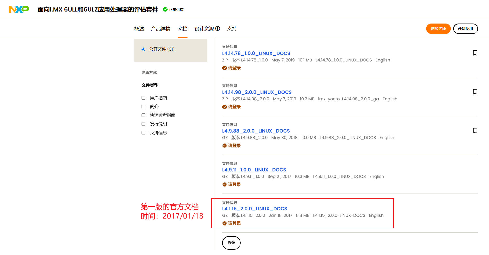
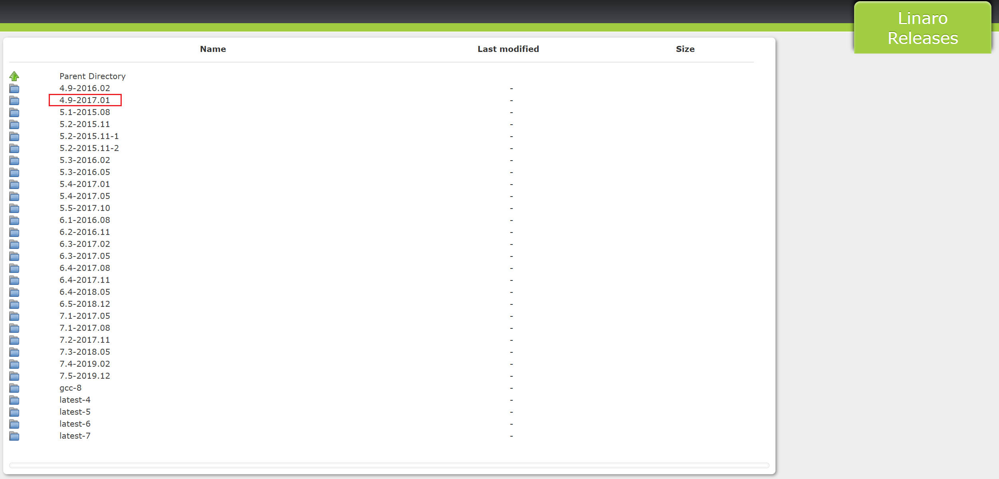
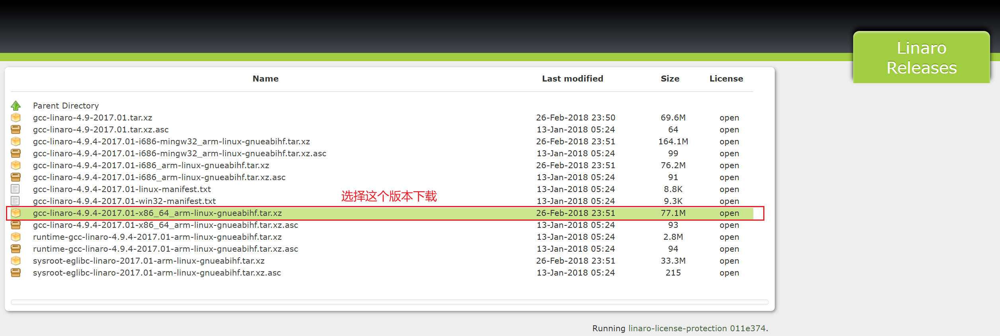
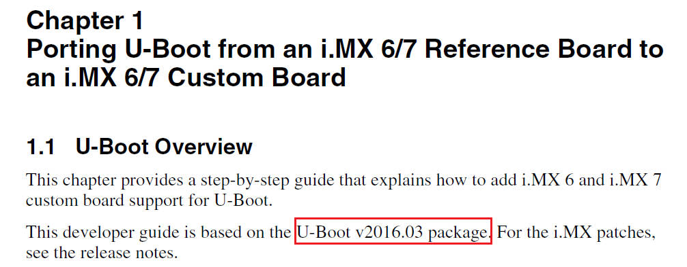
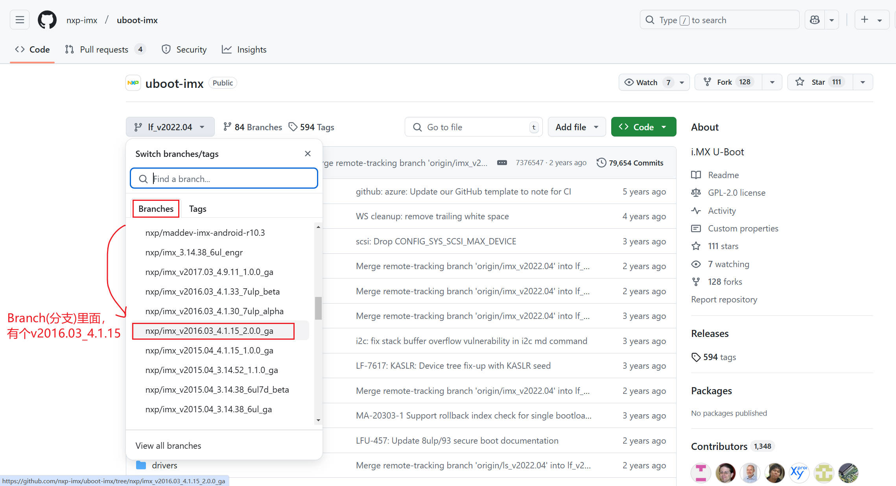
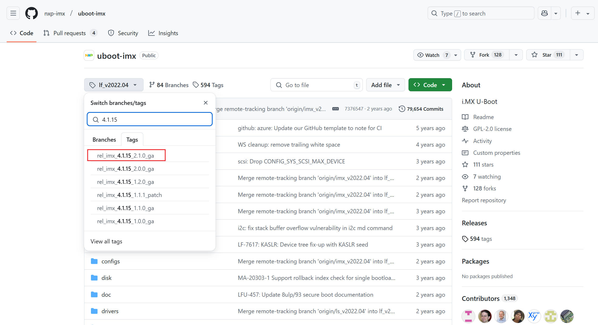

# imx6ull开发资源下载

## 下载demo板官方文档

在开始学习imx6ull之前，先参考官方提供的imx6ullevk demo板资料。

[imx6ullevk demo板资料](https://www.nxp.com.cn/design/design-center/development-boards-and-designs/i-mx-evaluation-and-development-boards/evaluation-kit-for-the-i-mx-6ull-and-6ulz-applications-processor:MCIMX6ULL-EVK)



*下载这份文档，看看evk板是怎么运行，然后我们就可以移植uboot kernel。*

## 交叉编译工具链

### 下载

既然已经选定了官方文档(2017/01/18)，接下来就要选择对应的交叉编译工具链。我们的原则是，尽可能选择时间上最接近的版本，否则版本不匹配可能会遇到各种编译问题。

看下`arm-linux-gnueabihf`编译器的版本：`4.9-2017.01`

[arm-linux=gnueabihf 下载链接](https://releases.linaro.org/components/toolchain/binaries/)



下载 [交叉编译工具链](./src/gcc-linaro-4.9.4-2017.01-x86_64_arm-linux-gnueabihf.tar.xz)



### 安装

+ 创建安装位置的文件夹

    `sudo mkdir /usr/local/arm`

+ 拷贝编译器到文件夹下，并解压

    ```sh
    sudo cp gcc-linaro-4.9.4-2017.01-x86_64_arm-linux-gnueabihf.tar.xz /usr/local/arm/
    cd /usr/local/arm/
    sudo tar vxf gcc-linaro-4.9.4-2017.01-x86_64_arm-linux-gnueabihf.tar.xz
    ```

+ 设置环境变量，指定交叉编译器的位置

    ```sh
    sudo vim /etc/profile
    # 在最尾部添加下面这行
    export PATH=$PATH:/usr/local/arm/gcc-linaro-4.9.4-2017.01-x86_64_arm-linux-gnueabihf/bin
    ```

    重启虚拟机，查看交叉编译器的版本

    ```sh
    ding@linux:~$ arm-linux-gnueabihf-gcc -v
    使用内建 specs。
    COLLECT_GCC=arm-linux-gnueabihf-gcc
    COLLECT_LTO_WRAPPER=/usr/local/arm/gcc-linaro-4.9.4-2017.01-x86_64_arm-linux-gnueabihf/bin/../libexec/gcc/arm-linux-gnueabihf/4.9.4/lto-wrapper
    目标：arm-linux-gnueabihf
    配置为：/home/tcwg-buildslave/workspace/tcwg-make-release/label/docker-trusty-amd64-tcwg-build/target/arm-linux-gnueabihf/snapshots/gcc-linaro-4.9-2017.01/configure SHELL=/bin/bash --with-mpc=/home/tcwg-buildslave/workspace/tcwg-make-release/label/docker-trusty-amd64-tcwg-build/target/arm-linux-gnueabihf/_build/builds/destdir/x86_64-unknown-linux-gnu --with-mpfr=/home/tcwg-buildslave/workspace/tcwg-make-release/label/docker-trusty-amd64-tcwg-build/target/arm-linux-gnueabihf/_build/builds/destdir/x86_64-unknown-linux-gnu --with-gmp=/home/tcwg-buildslave/workspace/tcwg-make-release/label/docker-trusty-amd64-tcwg-build/target/arm-linux-gnueabihf/_build/builds/destdir/x86_64-unknown-linux-gnu --with-gnu-as --with-gnu-ld --disable-libmudflap --enable-lto --enable-objc-gc --enable-shared --without-included-gettext --enable-nls --disable-sjlj-exceptions --enable-gnu-unique-object --enable-linker-build-id --disable-libstdcxx-pch --enable-c99 --enable-clocale=gnu --enable-libstdcxx-debug --enable-long-long --with-cloog=no --with-ppl=no --with-isl=no --disable-multilib --with-float=hard --with-mode=thumb --with-tune=cortex-a9 --with-arch=armv7-a --with-fpu=vfpv3-d16 --enable-threads=posix --enable-multiarch --enable-libstdcxx-time=yes --with-build-sysroot=/home/tcwg-buildslave/workspace/tcwg-make-release/label/docker-trusty-amd64-tcwg-build/target/arm-linux-gnueabihf/_build/sysroots/arm-linux-gnueabihf --with-sysroot=/home/tcwg-buildslave/workspace/tcwg-make-release/label/docker-trusty-amd64-tcwg-build/target/arm-linux-gnueabihf/_build/builds/destdir/x86_64-unknown-linux-gnu/arm-linux-gnueabihf/libc --enable-checking=release --disable-bootstrap --enable-languages=c,c++,fortran,lto --build=x86_64-unknown-linux-gnu --host=x86_64-unknown-linux-gnu --target=arm-linux-gnueabihf --prefix=/home/tcwg-buildslave/workspace/tcwg-make-release/label/docker-trusty-amd64-tcwg-build/target/arm-linux-gnueabihf/_build/builds/destdir/x86_64-unknown-linux-gnu
    线程模型：posix
    gcc 版本 4.9.4 (Linaro GCC 4.9-2017.01) 
    ```

## uboot下载

文档`i.MX_BSP_Porting_Guide.pdf`中有下述描述，就是这个文档对应的uboot发布时间。



现在知道uboot是`v2016.03`了，怎么去找对应的的源码呢？这是IMX官方uboot的地址 [官方uboot](https://github.com/nxp-imx/uboot-imx) 维护了所有的uboot版本。

v2016.03 使用的uboot版本是4.1.15，2.0.0表示厂商自己的版本，_ga表示稳定版本。



通常来说，我们不直接使用Branch分支的代码，因为可能随时被修改，而是使用Tag的稳定版本。因此，我们选一个`4.1.15 uboot`的最高版本。

可以看到，`4.1.15`的最新版本如下：`4.1.15_2.1.0`，这与正点原子的uboot版本也一致。



因此，我们就下载到了 [uboot](./src/uboot-imx-rel_imx_4.1.15_2.1.0_ga.zip)

## 总结

imx6ullevk demo板资料(包括uboot移植文档): fsl_yocto-L4.1.15_2.0.0-ga.tar.gz

交叉编译工具链: gcc-linaro-4.9.4-2017.01-x86_64_arm-linux-gnueabihf.tar.xz

demo板对应的uboot源码: uboot-imx-rel_imx_4.1.15_2.1.0_ga.zip
